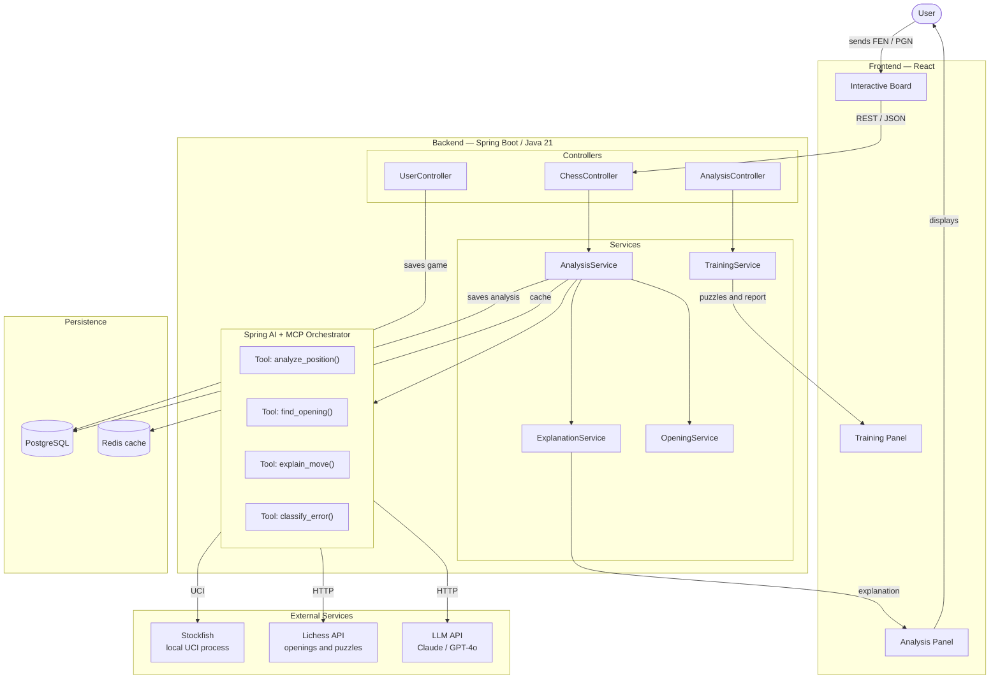
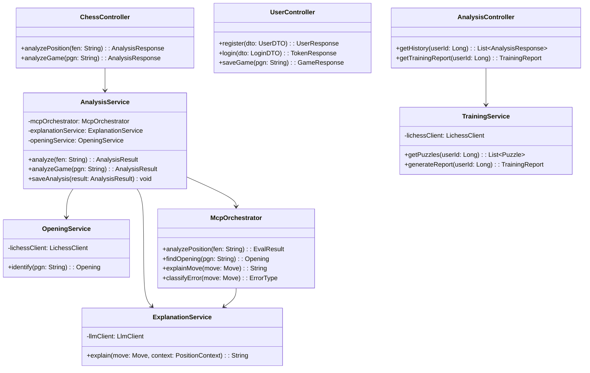

# Chess Analyzer

Web application for chess game analysis, training, and opening study.
The system combines a local chess engine (Stockfish), data from the Lichess API, and a large language model (LLM) to deliver detailed analyses and move explanations.

---

## Table of Contents

- [Architecture Overview](#architecture-overview)
- [Technology Stack](#technology-stack)
- [Components](#components)
  - [Frontend](#frontend)
  - [Backend](#backend)
  - [External Services](#external-services)
  - [Persistence](#persistence)
- [Data Flow](#data-flow)
- [Class Diagram (Backend)](#class-diagram-backend)
- [Getting Started](#getting-started)
- [Environment Variables](#environment-variables)

---

## Architecture Overview



---

## Technology Stack

| Layer               | Technology                               |
|---------------------|------------------------------------------|
| Frontend            | React                                    |
| Backend             | Java 21 + Spring Boot                   |
| AI Orchestration    | Spring AI + MCP (Model Context Protocol)|
| Chess Engine        | Stockfish (local UCI process)            |
| Openings / Puzzles  | Lichess API                              |
| Language Model      | Claude / GPT-4o                          |
| Database            | PostgreSQL                               |
| Cache               | Redis                                    |

---

## Components

### Frontend

| Component          | Description                                                        |
|--------------------|--------------------------------------------------------------------|
| Interactive Board  | Main interface for entering positions in FEN or PGN format         |
| Analysis Panel     | Displays position evaluation and move explanations                 |
| Training Panel     | Shows puzzles and user progress reports                            |

### Backend

#### Controllers

| Controller           | Responsibility                                           |
|----------------------|----------------------------------------------------------|
| `ChessController`    | Receives positions (FEN/PGN) and triggers analysis       |
| `UserController`     | Handles authentication and game persistence              |
| `AnalysisController` | Manages analysis history and training sessions           |

#### Services

| Service              | Responsibility                                                      |
|----------------------|---------------------------------------------------------------------|
| `AnalysisService`    | Coordinates the analysis pipeline and invokes the MCP Orchestrator  |
| `ExplanationService` | Generates natural-language explanations for each move               |
| `OpeningService`     | Identifies and retrieves information about chess openings           |
| `TrainingService`    | Selects puzzles and generates training reports                      |

#### MCP Orchestrator (Spring AI)

| Tool                  | Description                                                        |
|-----------------------|--------------------------------------------------------------------|
| `analyze_position()`  | Sends the position to Stockfish and returns evaluation and line    |
| `find_opening()`      | Queries the Lichess API to identify the opening played             |
| `explain_move()`      | Requests a natural-language explanation from the LLM               |
| `classify_error()`    | Classifies tactical and strategic errors in the move               |

### External Services

| Service     | Protocol  | Function                                              |
|-------------|-----------|-------------------------------------------------------|
| Stockfish   | UCI       | Position evaluation and best-move calculation         |
| Lichess API | HTTP/REST | Opening database and puzzle library                   |
| LLM API     | HTTP/REST | Natural-language explanation generation               |

### Persistence

| Store      | Usage                                                          |
|------------|----------------------------------------------------------------|
| PostgreSQL | Games, users, analysis history                                 |
| Redis      | Cache for recent analyses to reduce latency                    |

---

## Data Flow

1. The user submits a position in **FEN** or **PGN** format via the interactive board.
2. The frontend sends the request as **REST/JSON** to the `ChessController`.
3. The `ChessController` delegates to `AnalysisService`, which invokes the **MCP Orchestrator**.
4. The MCP Orchestrator runs in parallel:
   - Sends the position to **Stockfish** via the UCI protocol to obtain an evaluation.
   - Queries the **Lichess API** to identify the opening.
   - Requests a move explanation from the **LLM**.
5. `AnalysisService` persists the analysis in **PostgreSQL** and caches it in **Redis**.
6. `ExplanationService` sends the explanation to the **Analysis Panel**.
7. `TrainingService` generates puzzles and reports displayed in the **Training Panel**.
8. The user views the results in the interface.

---

## Class Diagram (Backend)



---

## Getting Started

### Prerequisites

- Java 21
- Node.js 20+
- Docker and Docker Compose (for PostgreSQL and Redis)
- Stockfish installed and available on PATH
- API key for Claude or GPT-4o

### Backend

```bash
# Start infrastructure services
docker compose up -d

# Run the backend
./mvnw spring-boot:run
```

### Frontend

```bash
cd frontend
npm install
npm run dev
```

The application will be available at `http://localhost:5173` and the backend at `http://localhost:8080`.

---

## Environment Variables

Create a `.env` file in the backend project root with the following variables:

| Variable            | Description                                          |
|---------------------|------------------------------------------------------|
| `DATABASE_URL`      | PostgreSQL connection URL                            |
| `REDIS_URL`         | Redis connection URL                                 |
| `LLM_API_KEY`       | API key for the LLM provider (Claude / OpenAI)       |
| `LLM_PROVIDER`      | LLM provider: `anthropic` or `openai`                |
| `STOCKFISH_PATH`    | Absolute path to the Stockfish executable            |
| `LICHESS_API_TOKEN` | Lichess API access token (optional)                  |
