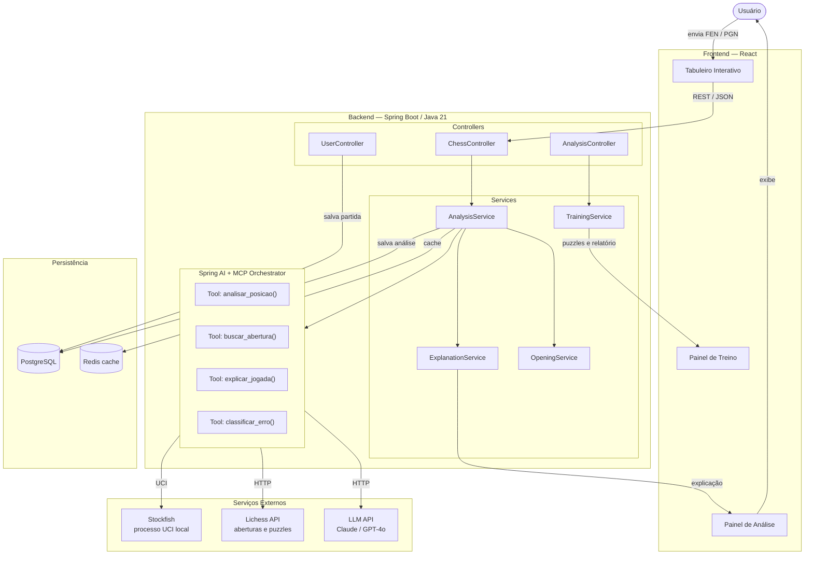
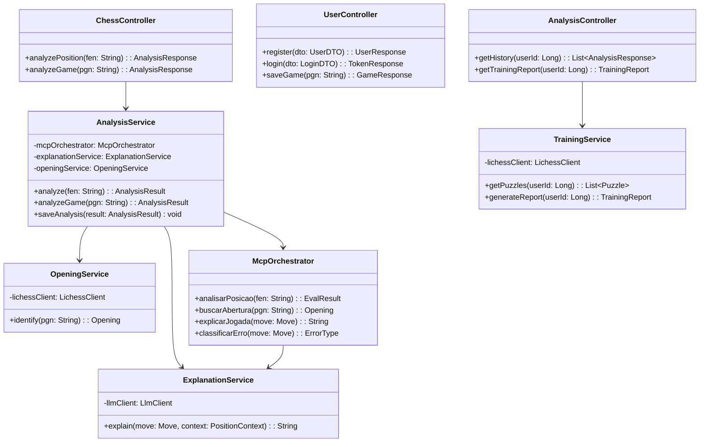

# Chess Analyzer

Aplicação web para análise de partidas de xadrez, treinamento e estudo de aberturas.
O sistema combina um motor de xadrez local (Stockfish), dados da Lichess API e um modelo de linguagem (LLM) para oferecer análises detalhadas e explicações das jogadas.

---

## Sumário

- [Visão Geral da Arquitetura](#visão-geral-da-arquitetura)
- [Stack Tecnológica](#stack-tecnológica)
- [Componentes](#componentes)
  - [Frontend](#frontend)
  - [Backend](#backend)
  - [Serviços Externos](#serviços-externos)
  - [Persistência](#persistência)
- [Fluxo de Dados](#fluxo-de-dados)
- [Diagrama de Classes (Backend)](#diagrama-de-classes-backend)
- [Como Executar](#como-executar)
- [Variáveis de Ambiente](#variáveis-de-ambiente)

---

## Visão Geral da Arquitetura



---

## Stack Tecnológica

| Camada            | Tecnologia                          |
|-------------------|-------------------------------------|
| Frontend          | React                               |
| Backend           | Java 21 + Spring Boot               |
| Orquestração IA   | Spring AI + MCP (Model Context Protocol) |
| Motor de xadrez   | Stockfish (processo UCI local)      |
| Aberturas/Puzzles | Lichess API                         |
| Modelo de linguagem | Claude / GPT-4o                   |
| Banco de dados    | PostgreSQL                          |
| Cache             | Redis                               |

---

## Componentes

### Frontend

| Componente       | Descrição                                                      |
|------------------|----------------------------------------------------------------|
| Tabuleiro Interativo | Interface principal para entrada de posições em FEN ou PGN |
| Painel de Análise    | Exibe a avaliação da posição e as explicações das jogadas   |
| Painel de Treino     | Apresenta puzzles e relatórios de progresso do usuário      |

### Backend

#### Controllers

| Controller         | Responsabilidade                                    |
|--------------------|-----------------------------------------------------|
| `ChessController`  | Recebe posições (FEN/PGN) e aciona a análise        |
| `UserController`   | Gerencia autenticação e persistência de partidas    |
| `AnalysisController` | Gerencia histórico de análises e sessões de treino |

#### Services

| Service              | Responsabilidade                                              |
|----------------------|---------------------------------------------------------------|
| `AnalysisService`    | Coordena o pipeline de análise, aciona o MCP Orchestrator     |
| `ExplanationService` | Gera explicações em linguagem natural para cada jogada        |
| `OpeningService`     | Identifica e recupera informações sobre aberturas             |
| `TrainingService`    | Seleciona puzzles e gera relatórios de treinamento            |

#### MCP Orchestrator (Spring AI)

| Tool                   | Descrição                                                  |
|------------------------|------------------------------------------------------------|
| `analisar_posicao()`   | Envia a posição ao Stockfish e retorna avaliação e variante|
| `buscar_abertura()`    | Consulta a Lichess API para identificar a abertura jogada  |
| `explicar_jogada()`    | Solicita ao LLM uma explicação da jogada em linguagem natural |
| `classificar_erro()`   | Classifica erros táticos e estratégicos cometidos         |

### Serviços Externos

| Serviço     | Protocolo | Função                                              |
|-------------|-----------|-----------------------------------------------------|
| Stockfish   | UCI       | Avaliação de posições e cálculo de melhores variantes|
| Lichess API | HTTP/REST | Base de aberturas e puzzles                         |
| LLM API     | HTTP/REST | Geração de explicações em linguagem natural         |

### Persistência

| Armazenamento | Uso                                                        |
|---------------|------------------------------------------------------------|
| PostgreSQL    | Partidas, usuários, histórico de análises                  |
| Redis         | Cache de análises recentes para redução de latência        |

---

## Fluxo de Dados

1. O usuário envia uma posição em formato **FEN** ou **PGN** pelo tabuleiro interativo.
2. O frontend envia a requisição via **REST/JSON** para o `ChessController`.
3. O `ChessController` delega ao `AnalysisService`, que aciona o **MCP Orchestrator**.
4. O MCP Orchestrator executa em paralelo:
   - Envia a posição ao **Stockfish** via protocolo UCI para obter a avaliação.
   - Consulta a **Lichess API** para identificar a abertura.
   - Solicita ao **LLM** uma explicação da jogada.
5. O `AnalysisService` persiste a análise no **PostgreSQL** e armazena em cache no **Redis**.
6. O `ExplanationService` envia a explicação para o **Painel de Análise**.
7. O `TrainingService` gera puzzles e relatórios exibidos no **Painel de Treino**.
8. O usuário visualiza os resultados na interface.

---

## Diagrama de Classes (Backend)



---

## Como Executar

### Pré-requisitos

- Java 21
- Node.js 20+
- Docker e Docker Compose (para PostgreSQL e Redis)
- Stockfish instalado e disponível no PATH
- Chave de API para Claude ou GPT-4o

### Backend

```bash
# Suba os serviços de infraestrutura
docker compose up -d

# Execute o backend
./mvnw spring-boot:run
```

### Frontend

```bash
cd frontend
npm install
npm run dev
```

A aplicação estará disponível em `http://localhost:5173` e o backend em `http://localhost:8080`.

---

## Variáveis de Ambiente

Crie um arquivo `.env` na raiz do projeto backend com as seguintes variáveis:

| Variável              | Descrição                                      |
|-----------------------|------------------------------------------------|
| `DATABASE_URL`        | URL de conexão com o PostgreSQL                |
| `REDIS_URL`           | URL de conexão com o Redis                     |
| `LLM_API_KEY`         | Chave de API do provedor de LLM (Claude/OpenAI)|
| `LLM_PROVIDER`        | Provedor do LLM: `anthropic` ou `openai`       |
| `STOCKFISH_PATH`      | Caminho absoluto para o executável do Stockfish|
| `LICHESS_API_TOKEN`   | Token de acesso à Lichess API (opcional)       |
